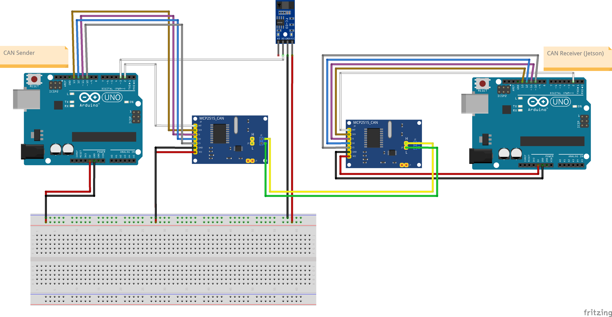

# Instrument Cluster Architecture

## Components

* Jetson NANO
* Arduino Uno R3
* RS485 CAN for Jetson Nano (MCP2515)
* MCP2515 CAN Module
* LM393 Speedsensor
* 7.9inch DSI LCD

## Diagram

### System

### Container

### Deployment

## Schematics

A test was performed with two Arduino Uno R3s, both connected
to CAN BUS shields. One of them, connected to a LM393 speed sensor sent CAN messages via CAN BUS,
and the other Arduino was receiving them.

