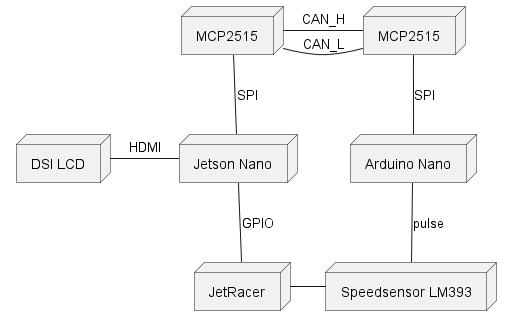

# Instrument Cluster Architecture

## Components

* Jetson NANO
* Arduino Uno R3
* RS485 CAN for Jetson Nano (MCP2515)
* MCP2515 CAN Module
* LM393 Speedsensor
* 7.9inch DSI LCD

## Diagram

## Schematics
