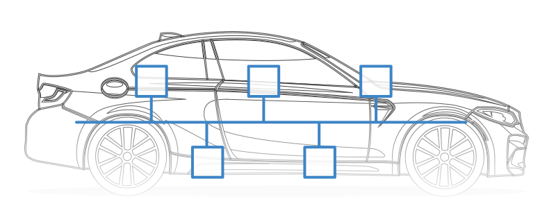
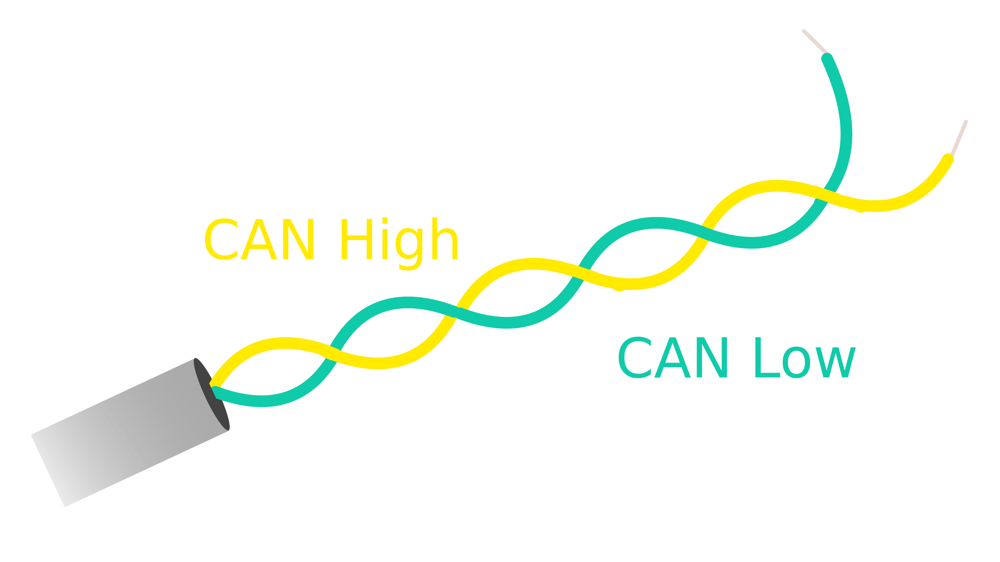
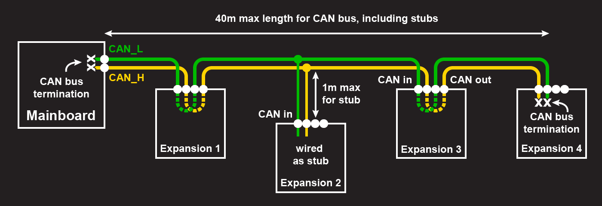
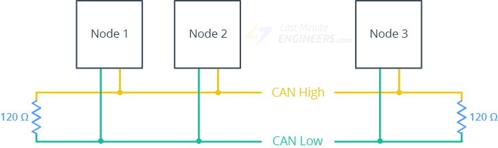
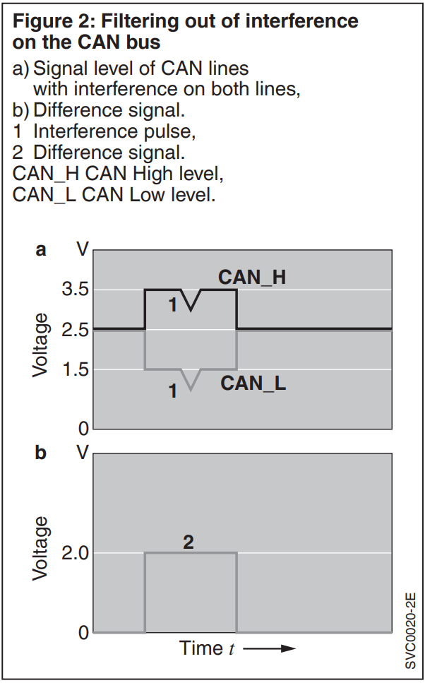
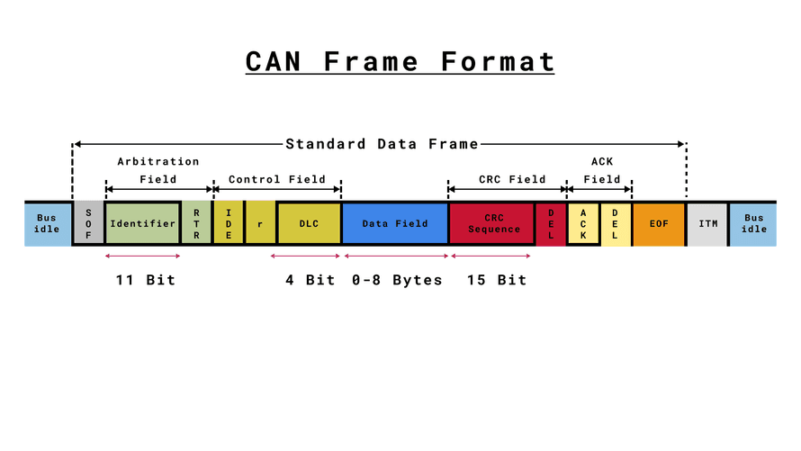
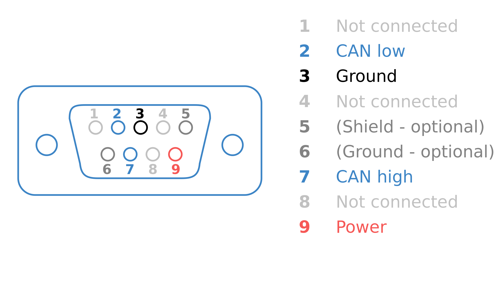
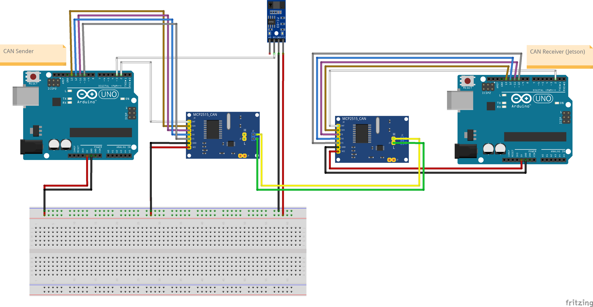

# Controller Area Network (CAN)

A CAN Bus (Controller Area Network) is a communication protocol developed by Bosch which efficiently supports distributed realtime control. In automotive electronics, engine control units (ECUs), sensors, etc, are connected using CAN with bitrates up to 1 Mbit/s. It reduces the complexity of wiring and improves reliability. It established itself as the standard since its first series introduction in motor vehicles in 1991.

Before CAN bus, vehicles and machines used a lot of individual wires to connect each component, making the systems bulky and prone to errors.

ECUs are connected to the bus in a multi-master configuration. Meaning, each ECU can take control of the bus and broadcast information (such as sensor data) over it. The broadcasted data is accepted by all other ECUs on the CAN bus. Each ECU can then read the data and decide whether to accept it or ignore it.

A twisted pair of cables is used: the lines are called **CAN_H** and **CAN_L**. The far ends of the cable are terminated with 120-ohm resistors. Because the CAN bus is a high-speed data bus, if the bus is not terminated, the signal will reflect back and interfere with the next data signal coming down the line, potentially disrupting communications and causing the bus to fail.

CAN uses a bus topology. There should be a single central cable (called the bus) running through the system, with just short cables (called stubs) connecting each device to the bus. As a rough rule of thumb, keep the stubs length less than 30cm in length for 1Mb/s, to minimize the impact of signal reflections.

Another way to wire the CAN bus is **daisy-chain** style, in which each node on the CAN bus needs CAN wires from the previous device and CAN wires to the next device (apart from the the nodes at each end).

The location of the resistors is important - be sure to place them at each end of the bus near the first and last devices. Some CAN devices come with termination resistors built-in. If the module is the first or the last node of the CAN network, then the jumper should be placed. If the module is a middle node, the jumper should be removed. To check if your bus has the right number of terminating resistors, you can use a multimeter to measure the DC resistance between the two data wires. If everything is correct you should measure around 60 ohm (two 120 ohm resistors in parallel). If it’s less, you have too many resistors. If it measures 120 ohm or open, you have too few.  [BaseJumper Docs CanBus]

The two wire cable facilitates a symmetrical data transfer in which the bits are transferred via both bus lines using different voltages. This reduces sensitivity to noise, since interference affects both lines and can be filtered out by creating the difference [Automotive Handbook, Bosch].

To communicate, the CAN bus uses the two states “dominant” and “recessive”, with which the information bits are transmitted. The dominant state represents “0”, the recessive “1”. the recessive state occurs when both the CAN_H and CAN_L lines are at the same voltage level, typically around 2.5V. This state signifies that no node is actively transmitting data, allowing other nodes to access the bus and send their messages. The recessive state plays a crucial role in the arbitration process, ensuring fair access to the communication bus.

When at least one CAN station transmits a dominant bit, it overwrites the recessive bits simultaneously sent by other stations.

**Message format**:

**Implementations:**

- Low Transfer Rate up to 125kbps (ISO 11898-3)
- High Transfer Rate up to 1mbps (ISO 11898-2; SAE J 1939 for trucks and buses)
- Time Triggered CAN (TTCAN) to include the capability of operating in time triggered mode (ISO 11898-4)
- CAN with flexible data rate (CAN-FD) that extends CAN by a second bit rate and wider data field (ISO 11898-7) [https://noelscher.com/blog/posts/compatibility-of-can-and-can-fd/]

Each CAN node, an Electronic Control Unit (ECU), consists of three primary elements [https://www.csselectronics.com/pages/can-bus-simple-intro-tutorial]:

- Microcontroller (MCU): interprets incoming CAN messages and transmits messages (e.g. speed sensor)
- CAN Controller: ensures communication adheres to CAN protocol
- CAN transceiver: connects the CAN controller to the physical wires

There is no standard connector across CAN bus applications, but a close candidate is the CAN DB9 connector.

**Available CAN Buses:**

- seedstudio CAN-BUS Shield 2.0 [https://wiki.seeedstudio.com/CAN-BUS_Shield_V2.0/]
    - adopts **MCP2515** CAN Bus controller with SPI interface and **MCP2551** CAN transceiver to give Arduino CAN-BUS capability
- RS485 CAN for Jetson NANO [https://www.waveshare.com/wiki/RS485_CAN_for_Jetson_Nano]
    - adopts MCP2515 CAN Bus controller via SPI and SIT65HVD230DR transceiver
- CAN MCP2515 Module with SPI interface and TJA1050 transceiver

**Note**: “Shields” is the name for peripherals that can be plugged directly on top of Arduino boards, and “Hat” is the name for peripherals for Rasperry Pi.

**TLDR:**

- CAN (Controller Area Network) is a robust communication protocol for distributed real-time control systems.
- It uses a bus topology with twisted pair cables (CAN_H and CAN_L) and 120-ohm termination resistors.
- CAN reduces wiring complexity, improves reliability, and is widely used in automotive and industrial applications.
- It supports various implementations, including low and high transfer rates, time-triggered CAN, and CAN with flexible data rate (CAN-FD).
- Each CAN node consists of a microcontroller, CAN controller, and CAN transceiver, enabling efficient communication between different components in a system.

## Testing

A test was performed with two Arduino Uno R3s, both connected
to CAN BUS shields. One of them, connected to a LM393 speed sensor sent CAN messages via CAN BUS,
and the other Arduino was receiving them.

